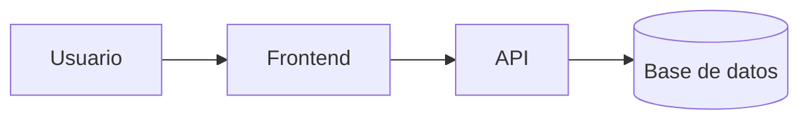

# Laboratorio README
 
Proyecto de practica para aprender Markdown avanzado en Git Hub.
## Descripcion
Este repositorio documenta paso a paso mi aprendizaje de Markdow: tablas, listas de tareas, badqes y deagramas.
## Estado de funcionalidades 

| Función  | Estado      | 
|----------|-------------|
| Login    | Listo       | 
| Reportes | En progreso | 
## Pendientes 
  
-	[x] Diseño de la base de datos 
-	[ ] Pruebas unitarias 
## Arquitectura

